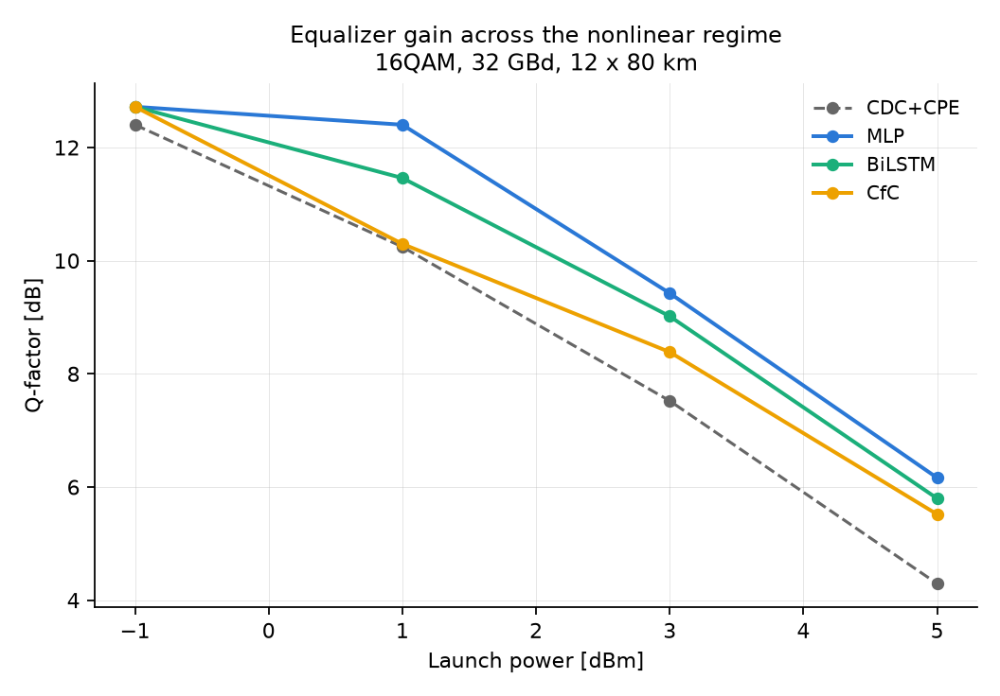
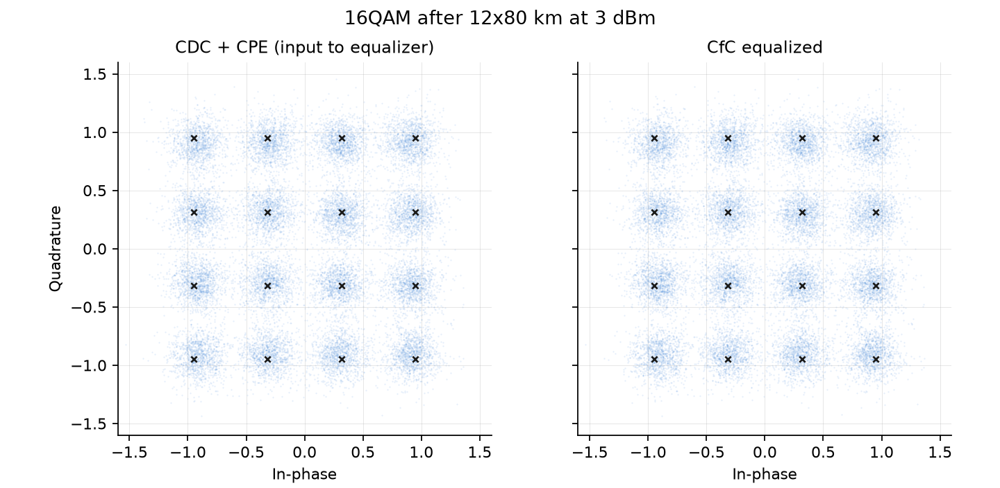

# Fluid-NN

**Liquid Neural Networks for real-time nonlinear equalization in coherent optical systems.**

Neural-network equalizers (BiLSTM, Volterra) can undo nonlinear fiber distortion, but
their per-symbol compute cost keeps them out of real-time DSP. This project tests
whether **closed-form continuous-time (CfC) liquid networks** reach the same equalization
quality at a fraction of the multiply-accumulate budget — and whether their adaptive,
input-dependent time constants track time-varying channels better than frozen discrete
models. See [PROJECT_PLAN.md](PROJECT_PLAN.md) for the full research plan and
[docs/RESEARCH_LOG.md](docs/RESEARCH_LOG.md) for the experiment-by-experiment record,
including negative results and their measured diagnoses.

## Current results (simulation testbed)

Single-polarization 16QAM, 32 GBd, 12 x 80 km SSMF, receiver CDC + ideal CPE.
Learned equalizers deliver up to **+2.2 dB Q** over the linear baseline across the
nonlinear regime; the constellation below shows the CfC cleaning +3 dBm distortion.





Honest state of the comparison (details and open items in the research log):
a well-regularized window **MLP currently leads on accuracy**; the **BiLSTM** is close
behind and adapts to drift with the fewest pilots; the **CfC** delivers solid gains at
high powers, wins on parameters, and its streaming mode — one cell update per symbol —
is the standing candidate for real-time deployment, still under active development.

## Repository layout

```
fluidnn/
  channel/        coherent link simulation
    modulation.py   Gray-coded square QAM (4/16/64/256)
    pulse.py        root-raised-cosine shaping, delay-free circular filtering
    ssfm.py         split-step Fourier NLSE propagation, multi-span EDFA + ASE
    receiver.py     chromatic dispersion compensation, matched filter, scaling
    link.py         end-to-end bits -> waveform -> fiber -> Rx symbols
    dataset.py      sliding-window supervised dataset construction
  models/         equalizers with a shared (batch, T, 2) -> (batch, 2) interface
    mlp.py          feed-forward baseline
    lstm.py         bidirectional LSTM (the strong discrete-time baseline)
    cfc.py          closed-form continuous-time cell (Hasani et al. 2022),
                    window mode + O(1)-per-symbol streaming mode
  training/       shared train/eval harness (identical data, budget, metrics)
  metrics.py      BER, SER, EVM, Q-factor, exact AWGN QAM theory
experiments/
  spike.py        first end-to-end accuracy-vs-complexity comparison
tests/            physics validation suite
```

## Setup

```bash
pip install -e .            # numpy + scipy (channel simulation)
pip install torch matplotlib  # equalizer training + figures
```

## Quick start

```bash
python -m pytest tests/     # validate the physics (~20 tests, <1 min)
python experiments/spike.py # run the first benchmark (CPU, ~20 min)
```

## Physics validation

The simulator is tested against analytically known behaviour, not just smoke-tested:

- linear propagation is exactly inverted by dispersion compensation
- Gaussian pulse broadening matches the closed-form dispersion law
- lossless nonlinear propagation conserves energy (unitary split-step)
- a CW field acquires exactly the theoretical nonlinear phase γ·P·L_eff
- measured SER over AWGN matches the exact Gray-QAM formula
- a noise-free linear link is error-free end to end

## Complexity accounting

Every model reports **weight MACs per recovered symbol** — the number that maps to
ASIC/FPGA cost. Window-mode models pay their full window sweep per symbol; the CfC
additionally supports a streaming mode that carries state and pays one cell update
per symbol, which is where the real-time argument lives.
